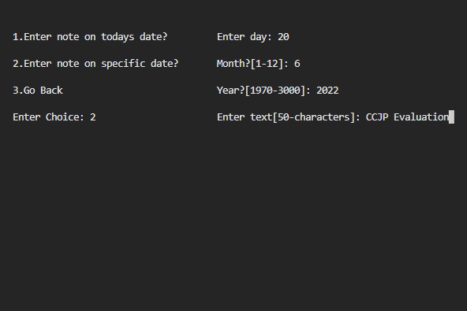
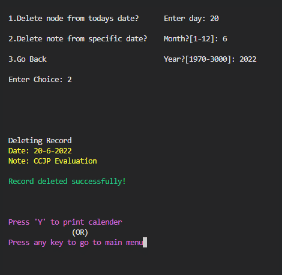
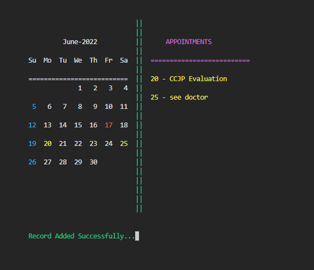
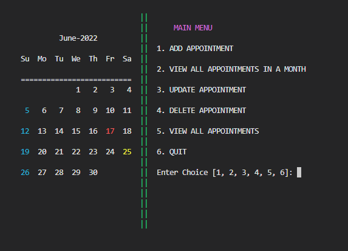
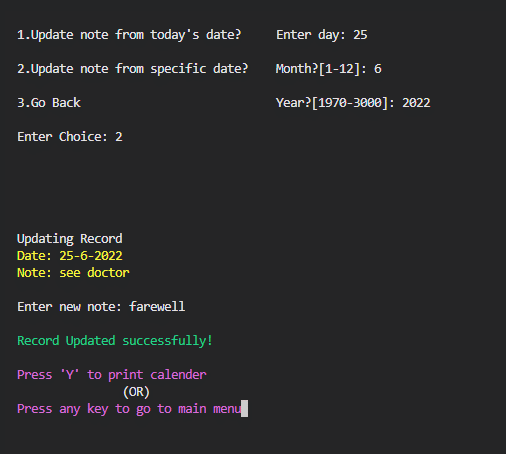

# Simple Calender Appointment System

#### Implemented using doubly linked list in C language

## About the project

The primary goal of this software is to provide a practical example of the doubly linked list data structure in use.
Through the program, users can manage their appointments and keep track of them. It displays the current month with the
date at the start of the program and enables users to modify their appointments and perform various operations on them.
By implementing the doubly linked list data structure, the program aims to demonstrate its practical use in real-world
scenarios. The program is written in C, making it an excellent tool for those interested in learning about the
implementation of data structures in programming.

## Screenshots

